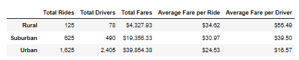

# PyBer_Analysis

## Project Overview
Pyber ride sharing has given us 2 sets of data to work with for this analysis. The [City Data CSV](Resources/city_data.csv) contains info about the 120 cities that Pyber operates in. Cities contain the amount of drivers that work there and are categorized by Urban, Suburban, and Rural  The [Rider Data CSV]( Resources/ride_data.csv) contains ride data taken from January-May 2019. There are 2375 total rides to analyze for this analysis. We have data for the fare that was charged and a unique identifier.
### Purpose

We were asked to summarize the data given to us to help Pyber make decisions about their ride share app. To make a meaningful summary we will look at 5 key points of data.
-	What were the total amount of drivers for each area type.
-	How many drivers cover each area type.
-	How much fare was collected in the area.
-	What was the average fare cost for each ride.
- 	On Average, how much fare did each driver collect.

## Analysis

### Methodology

This project will be created using Python and 2 of its libraries, Pandas, and matplotib. Pandas will be utilized to read in data, combine it together, and manipulate it to get the data we need. All the data will be grouped by what type of city it occurred in. we will sum the amount of drivers, sum the fare taken, and count each unique ride that took place in the data set. After the data has been manipulated we will use the matplotlib library and its integration with pandas to create figures that will be easy for Pyber to read and utilize.
### Results

For most of the data we will utilize the data frame posted above to analyze the numerical data. Alongside figure. For fare data we will also look at a graph showing how fare changes over time.

Looking at the table, we will 1st look at is the make up of total riders. Looking at the table we can see that Urban cities had far more riders than the other 2 types of areas. This would suggest that most of the traffic takes place in urban areas. when we look at total drivers we see a larger shift to urban for the make up. Comparing total drivers to total riders we can see that urban is the only area to have more drivers than actual rides. This piece of data may indicate that the urban areas may have more drivers than is necessary. This is also shown by looking at the average fare per driver. Urban areas have an average Fare of just $16.57 per driver, This may be due to the large quantity of drivers in the area on top of shorter distances to drive overall, we can clearly see this when looking at the average fare per ride. Urban area have an average fare of $24.53, much closer to the $30.97 taken in by suburban rides and $34.82 taken in by rural. These values will only be affected by the distance of the ride in question meaning it shows us a good baseline for how drivers effect the profit. Of all the markets Urban is still bringing in the most money with $39.854.38 in fares. Other the other hand, despite bringing in the
